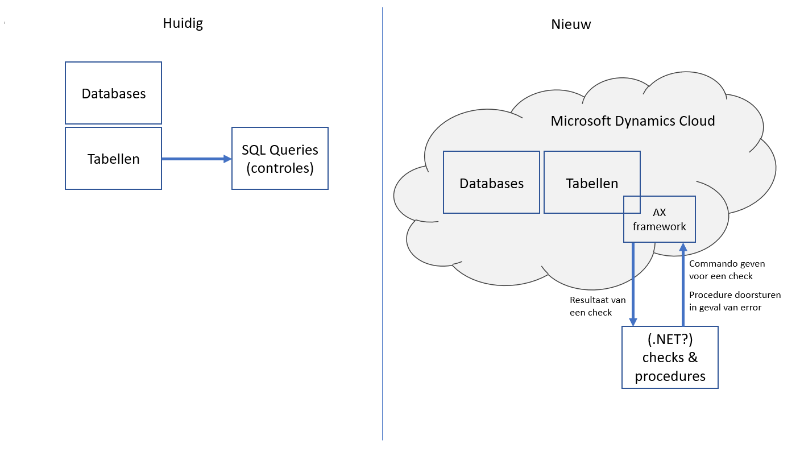
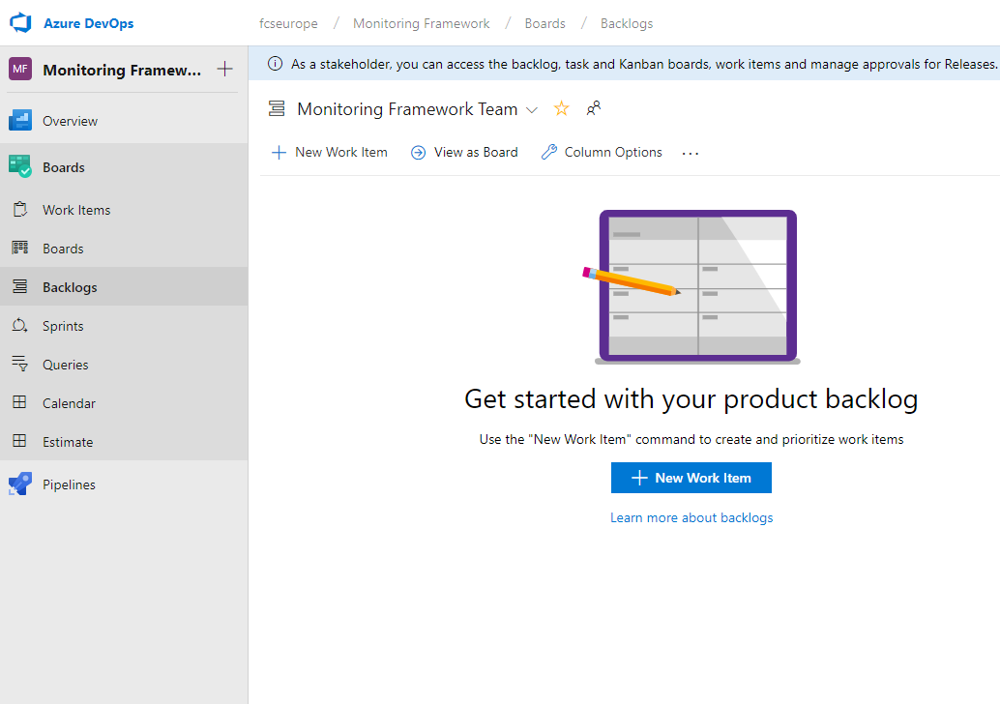
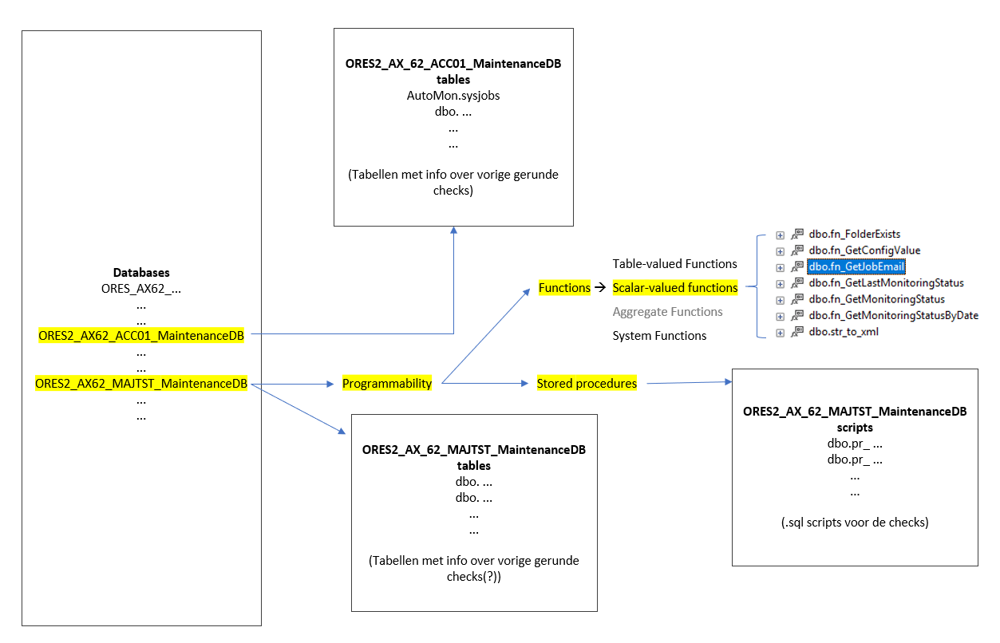

# Voortgangsverslag #1
# Monitoring Framework op MECOMS 365
## Promotors

**Stagecoördinator:**  Marc Smets (marc.smets@ap.be)  
**Stagementor:**  Jurgen Beyens (jurgen.beyens@mecoms.com)  
**Stagebegeleider:** Serge Horsmans  (serge.horsmans@ap.be)  
**Opleidingshoofd:**  Yves Masset (yves.masset@ap.be)  

<!--Zet hier alle namen+email van je verschillende promotors (stagebegeleider,
stagementor). Zeker in vet zetten indien er veranderingen hebben
plaatsgevonden-->

## Onderwerp

**Initiële situatie**

MECOMS (MEtering and COntract Management System) is een standaard ERP pakket voor nutsbedrijven (elektriciteit, gas, water,..) 
en is door Ferranti gebouwd bovenop het standaard ERP pakket Microsoft Dynamics.
Naast dat MECOMS pakket is een monitoring framework gemaakt voor het monitoren van dit business
process. Het huidige "probleem" is dat dit framework gebaseerd is op AX 2012, dat door Microsoft 
vervangen gaat worden door Dynamics 365, wat een cloud-based oplossing is.

Ongeveer twee jaar geleden is dit monitoring framework begonnen als enkele check-bestanden, geschreven in SQL.
Langzaam bleef dit maar uitbreiden tot recent waarbij is beslist dat dit te groot is voor de huidige architectuur
en er een nieuwe oplossing moest komen. Dat is Dynamics 365. De manier waarop we onze oplossing gaan toepassen in 
Dynamics 365 is nog niet honderd procent zeker. Hier had ik wel een oplossing voor bedacht en gevisualiseerd in Powerpoint.

De eerste dagen was er, naast het installeren van de nodige programma's zoals Visual Studio en Microsoft SQL Server Management Studio 2017
de taak om de structuur van het huidige project in SQL te begrijpen. Dit, met de hulp
van het visualiseren in Powerpoint en het oplijsten van de procedures + tabellen hielpen bij het begrijpen van de huidige situatie van 
het project en de opdracht.

Maandag 18 februari was er 's middags ook een afspraak met de stagementor Jurgen Beyens voor meer uitleg over het "totaalplaatje"
van dit project. Dat houdt in: waarvoor dient het monitoring framework precies, waarom is er deze upgrade nodig, enzovoort..
Bij die afspraak waren nog enkele e-learning video's en .pdf bestanden voorzien.

**Projectmanagement**

Vrijdag 15 februari is er gevraagd om een projectmanagementomgeving op te zetten. Dit zodat er nog voor het 
indienen van dit verslag een eerste sprint kan gemaakt en gestart worden. Bij Ferranti wordt er gebruik gemaakt
van Azure DevOps, in tegenstelling tot Jira op de AP Hogeschool. Azure DevOps is wel heel vergelijkbaar met het gekende
Jira board. Dit zorgde er voor dat de projectmanagement vlot kon opgezet worden.

Kort voor dit voortgangsverslag zijn de eerste stories en sprint opgezet op de Azure DevOps omgeving.
De structuur is iets anders dan in de meeste Jira projecten op de AP Hogeschool. In de backlog zijn er maar
enkele issues geplaatst (5 à 7). Een enkele issue heeft ongeveer de grote van een tweewekelijkse sprint.
Deze issue bestaat uit vele kleinere subtasks die een specifiekere beschrijving hebben en het totaal aantal
story points bepalen voor de "main" issue, die normaal gezien één sprint gaat representeren.

De volledige projectmanagement zal bestaan uit 6 sprints, die wel uitgaan van een "idealistische situatie". De laatste sprints
bevatten de "extra" opgaves, moest er nog extra tijd beschikbaar zijn. (User Interface, Mobiele App)

**Verwachtingen**

Met dit nieuwe systeem heeft Ferranti bovendien zelf geen toegang meer tot alle data in Dynamics 365. Daarom moet het
monitoring framework in een aparte service runnen, ook liever op C# (.NET) dan SQL. Dat "aparte" framework zal dan de 
data op Dynamics raadplegen voor een check en volgens het resultaat van die check, het nodige doen als reactie. Dit kan zijn in
de vorm van een niet-dringende e-mail die tijdens de werkuren dan wordt gezien. Maar ook als een dringende e-mail naar een call-center
dan dan iemand opbellen om het probleem zo snel mogelijk oplossen. Als we spreken over een gekend probleem gaat het framework een procedure
aanspreken en dat zelf oplossen. Dit wordt natuurlijk ook gerapporteerd ondanks dat het probleem meestal onmiddelijk is opgelost.

Veel van de self-healing functies in dit framework zijn momenteel al operationeel in SQL. Dat gaat mee gewijzigd worden met die
aparte service, hoogstwaarschijnlijk in C#. Bovendien moeten er zulke functies of proceduren makkelijk kunnen worden bij gemaakt.
Kort gezegd: het framework moet dus ook makkelijk expandable en scalable zijn.

Tegen het einde van de stageperiode is het de bedoeling dat honderd procent van dit huidige framework op het vernieuwde
Microsoft Dynamics 365 werkt. Alle checks, procdures bij een gefaalde check en de *self-healing* acties moeten
werken op een, hopelijke ook efficiëntere manier dan initieel was. Bovenop dit project zijn nog een reeks "bonussen".
Namelijk een user interface waarin je de huidige status van het systeem kan zien, de geschiedenis, maar ook een admin-
gedeelte op checks toe te voegen, te verwijderen of te wijzigen, of om instellingen/e-mail addressen te configureren.

De tweede bonus is een mobiele app, vergelijkbaar met de eerste UI maar dan met de extra mogelijkheid om mobiele notificaties
te geven in het geval dat er actie nodig is. Momenteel is het systeem afhankelijk van een automatische e-mail, eventueel zelfs
naar een call-center bij dringende problemen buiten de werkuren.

<!--Beschrijf je onderwerp van je BAP/Stage. Wat is het resultaat dat je wilt
bereiken tegen het eind van de BAP? Maak een analyse van het
onderwerp/resultaat. Geef de mogelijke stappen om je BAP/Stage tot een goed
eind te brengen. --> 
<!--Minimum 5000 tekens-->

## Keywords

* MECOMS
* SQL
* Monitoring
* Upgrade
* Microsoft Azure
* Dynamics 365
* Cloud
* .NET
* UI

<!--Noteer hier enkele relevante keywords van het onderwerp-->
<!--Minimum 5 keywords-->

## Milestones

**Eerste week (13/02/2019 - 15/02/2019)**
Visualiseren & verkennen van de huidige situatie

**Tweede week (18/02/2019- 22/02/2019)**
Bedenken en ontwerpen van de oplossingsarchitectuur + maken van eerste sprint

**Sprint 1 (21/02/2019 - 15/03/2019)**
Het bestaande framework omzetten naar de Dynamics oplossing, zorgen dat er checks kunnen uitgevoerd worden op deze nieuwe manier.

**Sprint 2 (18/03/2019 - 29/03/2019)**
Zorgen dat het framework op version-control kan checken. Eerste zien of een nieuwe versie in een test-environment werk voordat die in productie gaat.

**Sprint 3 (01/04/2019 - 12/04/2019)**
Een configureerbare planning voor de checks (instellen van hun frequentie, etc.)

**Sprint 4 (15/04/2019 - 26/04/2019)**
Het framework moet self-healing werken. Het kan gekende issues na een check automatisch oplossen.

**Sprint 5 (29/04/2019 - 10/05/2019)**
Een user interface maken voor het framework met admin-gedeelte om checks en instellingen te beheren.

**Sprint 6 (13/05/2019 - 24/05/2019)**
Een mobiele app maken met gelijkaardige functies als de user interface + bovendien mobiele notifications bij een gefaalde check.

De laatste 2 sprints, en vooral de mobiele app zal in een idealistisch scenario gerealiseerd worden. Op deze manier zijn de sprints ook gepland.
De kans is reëel dat dit niet 100% aan dit tempo gaat verlopen. Maar daar is rekening mee gehouden aangezien de mobiele app een
"extra" is moest er nog tijd over zijn tijdens het verloop van de stage.

<!--Geef hier kort weer wat te behalen milestones zijn per week-->
